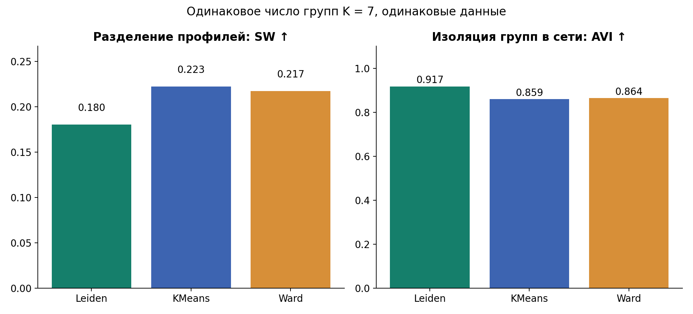
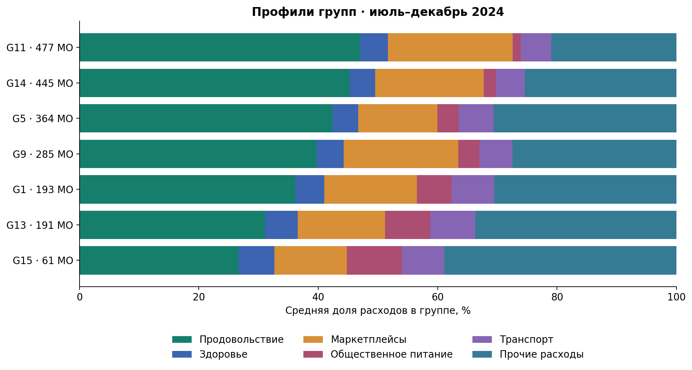
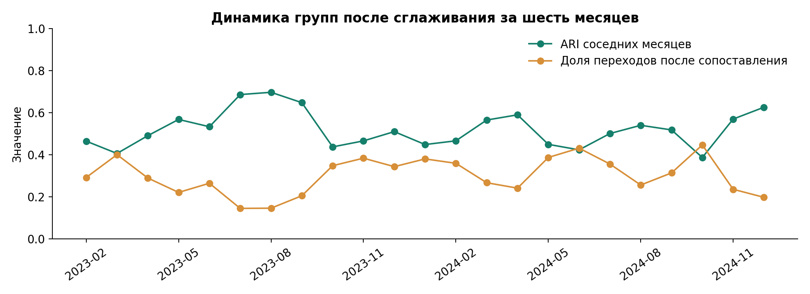
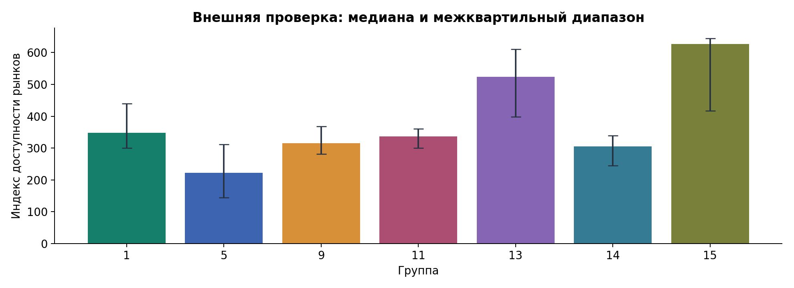

Экономический отпечаток муниципалитетов

Методологический отчёт · направление «Кластеризация»
Конкурс СберИндекса, 2026

**Исследовательский вопрос.** Какие устойчивые потребительские профили территорий можно выделить по структуре безналичных расходов, как меняется их состав и где заканчивается надёжность классификации?

**Основной результат.** Для 2,016 территорий построены 24 месячные атрибутированные сети. В декабре 2024 выявлено семь групп. Сравнение с K-means и Ward показывает различие между сетевой изоляцией и компактностью признаков. Доля маркетплейсов в среднем по территориям увеличилась с 11.7% в 2023 до 15.9% в 2024. Эти средние не взвешены по населению.

1. Данные и единица наблюдения

Источник: официальный архив СберИндекса, скачанный 07.10.2026. consumption.parquet содержит 303 126 строк, 2 190 territory_id и период 01.2023–12.2024. Фактическое имя числовой колонки — value, хотя описание архива называет её consumption. Показатель — модельная оценка средних безналичных расходов жителей МО в рублях, а не совокупный оборот торговых точек.

territory_id характеризует МО в постоянных границах. Сохраняем только полные ряды с шестью исходными категориями в каждом месяце: 2 016 территорий, 48 384 пары «территория–месяц». Исключены 174 территории с неполным покрытием. Пропуски не заменяем нулём и не интерполируем. Проверены дубликаты, неотрицательность, положительный общий расход и последовательность месяцев.

Дополнительные данные: индекс доступности рынков за 2024 и дорожные расстояния на 31.12.2024. Используем их только для внешней интерпретации, не включаем в признаки или подбор кластеров. Поэтому внешняя проверка не повторяет само правило кластеризации.

Код и все производные результаты воспроизводятся из включённых исходных файлов. Лицензия данных и результатов: CC BY-SA 4.0. Код: MIT. Географический справочник недоступен при подготовке: наименования МО и карта границ не используются, все примеры привязаны к проверенным territory_id.

---

2. Признаки и правило построения сети

Выделяем пять опубликованных компонентов: продовольствие, здоровье, маркетплейсы, общественное питание и транспорт. Добавляем «Прочие расходы» как разность «Все категории» и суммы пяти компонентов. «Все категории» не включаем повторно в вектор, чтобы исключить двойной счёт. Остаток проверен: отрицательных значений нет.

Для территории i, месяца t и категории c определяем p(i,t,c) = value(i,t,c) / value(i,t,all). Сумма шести долей равна 1. Нормировка снимает механическое влияние общего уровня расходов. Номинальный уровень сохраняем отдельно для интерпретации, он не создаёт рёбра.

Структурный профиль p̄(i,t) — арифметическое среднее месячных долей за доступные последние шесть месяцев. Это среднее структуры, а не доля суммы расходов за полугодие. Первые пять месяцев используют расширяющееся окно. Сглаживание заранее выбрано для среднесрочного профиля, снижает краткосрочную изменчивость и может задерживать обнаружение быстрых сдвигов. Сравниваем окна 1, 3 и 6 месяцев в отдельной чувствительности.

Атрибут узла x(i,t,c) = √p̄(i,t,c). Евклидово расстояние между такими векторами пропорционально расстоянию Хеллингера: H(i,j,t) = ||x(i,t) − x(j,t)||₂ / √2. Корневая трансформация корректно обрабатывает нулевые доли без искусственного псевдосчёта.

Для каждого узла выбираем k = 12 ближайших соседей, исключая сам узел. Неориентированное ребро (i,j) присутствует, если i входит в kNN(j) ИЛИ j входит в kNN(i). Вес w(i,j) = exp[−d(i,j)² / (σ(i)σ(j))], где σ(i) — расстояние до k-го соседа, с техническим нижним порогом 10⁻¹². Самопетли исключены. При равенстве расстояний сортируем по индексу.

Union-kNN предотвращает изоляцию редких профилей, но допускает связи между ядром и периферией. Повышение k сгущает сеть и может объединять группы. Локальная шкала веса компенсирует неодинаковую плотность признаков, но не доказывает наличие реальных экономических потоков. Рёбра означают сходство профилей потребления.

3. Алгоритмы и выбор параметров

Основной метод — Leiden с целевой функцией RBConfiguration и параметром разрешения γ. Кандидаты γ = 0.5, 0.8, 1.0, 1.3. На июне–августе 2023 выбираем максимальный средний SW среди кандидатов с минимальной группой ≥ 20 МО. Выбран γ = 0.5. Основные итоговые сравнения относятся к 2024 и последнему месяцу, первые месяцы являются разогревом сглаживания. Исследование описательное, не прогнозный бэктест.

Базовые методы: K-means (20 инициализаций) и агломеративный Ward. В каждом месяце задаём им то же K, которое получил Leiden, и используем те же признаки. Косинусное сходство долей проверяется как альтернативное правило создания рёбер. Одинаковое K делает сравнение методов прозрачнее, но не означает, что для каждого метода отдельно найдено оптимальное K.

---

4. Качество кластеризации

Все методы оцениваем в одинаковом пространстве признаков и на одной экономической сети. SW рассчитываем на фиксированной случайной выборке из 1 000 МО (seed = 42). CH и остальные показатели используют полную панель. Направления предпочтения: SW, CH, AVI, MQ и Q больше; S_Dbw и AVU меньше.

| Метод | SW | CH | S_Dbw | AVI | AVU | MQ | Q |
| Leiden | 0.180 | 917.2 | 1.351 | 0.917 | 0.539 | 0.0355 | 0.733 |
| KMeans | 0.223 | 1134.4 | 1.497 | 0.859 | 0.541 | 0.0238 | 0.701 |
| Ward | 0.217 | 1004.1 | 1.487 | 0.864 | 0.536 | 0.0321 | 0.690 |

Декабрь 2024, N = 2 016 и K = 7. K-means имеет наибольший SW и CH. Leiden имеет наибольший AVI, MQ и Q, а также наименьший S_Dbw в указанном варианте. Ward имеет чуть меньший AVU. Следовательно, сетевой метод усиливает внутригрупповую связанность, но не доминирует по всем критериям.

AVI: среднее по группам отношение внутренней ориентированной суммы весов к полной сумме весов, инцидентных группе. В неориентированном графе внутренняя связь считается дважды. AVU: 1/K · Σ(k≠l) e(k,l)/(b(k)+b(l)−e(k,l)), где b — внешняя сумма весов. Нулевой знаменатель для несвязанных групп даёт нулевой вклад. Формулы соответствуют Shalileh et al., 2026, уравнения 18–21.

MQ используем в явно заданном варианте плотностей: средняя внутригрупповая плотность 2m(k)/(n(k)(n(k)−1)) минус средняя межгрупповая плотность e(k,l)/(n(k)n(l)). Для singleton внутренняя плотность равна 0. MQ не подменяем модульностью Q, которую считаем отдельно. Вариант MQ важен: разные публикации используют разные определения.

S_Dbw: s-dbw 0.4.0, method=Halkidi, nearest_centr=True, metric=euclidean. Центр подсчёта плотности — наблюдение, ближайшее к геометрическому центру. Это явная библиотечная конвенция для исключения пустого центра на тонком многообразии долей. Геометрический вариант сохранён в коде как диагностический; при нулевом знаменателе возвращает NaN. CH/N также сохранён для сопоставимости размеров.

Случайная перестановка финальных меток сохраняет размеры групп. В 20 повторениях средний SW = -0.061, AVI = 0.142, Q = -0.001. Это техническая проверка наличия структуры в выбранных признаках и графе. Граф построен из тех же признаков, поэтому это не независимое экономическое доказательство.

---

5. Потребительские типы территорий

| Группа и описательный профиль | МО | Медиана расходов в декабре, ₽ |
| G1: Транспорт и общепит | 193 | 45 845 |
| G5: Умеренная доля маркетплейсов | 364 | 37 146 |
| G9: Маркетплейсы и услуги | 285 | 35 161 |
| G11: Продовольствие и маркетплейсы | 477 | 26 850 |
| G13: Общепит и здоровье | 191 | 59 521 |
| G14: Продовольственный смешанный | 445 | 28 925 |
| G15: Диверсифицированный сервисный | 61 | 70 842 |

Названия даны после анализа профилей и не являются внешними метками. Например, G11 имеет повышенную долю продовольствия (47.0%) и маркетплейсов (20.9%) при малой доле общепита (1.4%). G15 отличается меньшей долей продовольствия (26.6%), большей долей общепита (9.2%), здоровья (6.0%) и остаточных категорий (38.9%). Доли относятся к среднему профилю июля–декабря 2024.

Эта структура согласуется с различной диверсификацией потребления. Она не позволяет автоматически назвать группу промышленной, аграрной или туристической: для этого нужна независимая статистика занятости, выпуска или посещений. Более высокий номинальный расход также не является доказательством более высокого реального дохода.

Отдельный наблюдаемый сдвиг: средняя доля маркетплейсов 11.7% → 15.9%. В 99.6% пар «МО–месяц» прирост доли год к году положителен; средний прирост составляет 4.24 п. п. Сравниваются одинаковые календарные месяцы, используются исходные несглаженные доли. Причины сдвига на этих данных не идентифицированы.

---

6. Изменение групп и устойчивое ядро

Для соседних месяцев строим матрицу Jaccard между множествами членов групп. Венгерский алгоритм максимизирует суммарное совпадение при сопоставлении один к одному. Новым группам присваиваем новые идентификаторы. Матрица потоков сохраняет все переходы, поэтому разделения и объединения видны независимо от правила наименования. Номера групп — техническая история, а не неизменные экономические типы.

Средний ARI соседних месяцев = 0.522; средняя доля смены метки после сопоставления = 30.1%. Даже после сглаживания границы групп не становятся фиксированными. В таблице временной устойчивости отдельно сохранён ARI к тому же месяцу предыдущего года. Траектория исходных долей и расстояние Хеллингера нужны, чтобы отличать изменение самого профиля от перестановки границы кластеров.

На декабре 2024 выполнены 12 запусков с разными seed и 12 подвыборок по 80% МО без возвращения. Средний ARI по seed = 0.671; по подвыборкам = 0.552. Подвыборки — проверка устойчивости к составу данных, не классический bootstrap с возвращением.

Поддержка метки после Jaccard-сопоставления ≥ 80% в повторных seed у 1239 МО (61.5%). Остальные 777 МО обозначаются как пограничные. Это операционный фильтр для практического использования, а не доверительная вероятность истинного класса.

| Правило рёбер / окно | k | K | ARI к основной модели |
| hellinger | 8 | 9 | 0.596 |
| hellinger | 12 | 7 | 1.000 |
| hellinger | 20 | 7 | 0.509 |
| cosine | 8 | 12 | 0.325 |
| cosine | 12 | 10 | 0.375 |
| cosine | 20 | 9 | 0.376 |
| window_1 | 12 | 7 | 0.452 |
| window_3 | 12 | 6 | 0.591 |
| window_6 | 12 | 7 | 1.000 |

Cosine/Hellinger и k = 8, 12, 20 меняют сеть и часто K: ARI отражает общую чувствительность разбиения. Строки window сравнивают окна 1, 3 и 6 месяцев. Внешние показатели не используются для подбора параметров.

---

7. Внешняя интерпретация и применение

Индекс доступности рынков доступен для 2004 из 2 016 территорий. В декабрьских группах медианы различаются: например, G5 — 221.7, G13 — 524.0, G15 — 626.4. Критерий Краскела–Уоллиса: H = 764.5; описательный размер эффекта ε² = 0.380. Проверка выполнена постфактум на независимом от признаков показателе, однако пространственная зависимость ограничивает формальную интерпретацию p-value.

Медиана дорожного расстояния для 16,263 наблюдаемых экономических рёбер — 877.1 км. Для 16,246 наблюдаемых случайных пар — 1711.0 км. Это описательное свидетельство пространственной компоненты сходства. Сравнение не доказывает причинного влияния расстояния и не контролирует все особенности пары территорий.

**Практическое использование.** Для территории можно выбрать сопоставимые профили, проследить её доли расходов и изменение окружения. Региональному аналитику это помогает построить набор аналогов для мониторинга услуг и потребительского спроса. Пограничные территории проверяются вручную, а устойчивые ядра могут служить начальной типологией для дальнейшего объединения со статистикой Росстата.

**Визуализация.** Автономная интерактивная страница объединяет фиксированную PCA-проекцию, выбор territory_id, переключение месяца, ближайшие профили, сравнение территории со своей группой, Sankey всех переходов и метрики. Исходные месячные доли показываются отдельно от сглаженного профиля. Все точки и численные значения берутся из результатов расчёта.

Ограничения

Безналичные расходы отражают только часть потребления, исходные оценки модельные и номинальные. Средние по МО не взвешены населением. Выбор полной панели может исключать нестабильные и преобразованные территории и не позволяет обобщать результаты на все МО России. Два года данных недостаточны для надёжного выделения долгосрочных режимов и причинных шоков. Шестимесячное сглаживание задерживает быстрые изменения. Невысокий SW и неполная устойчивость показывают перекрытие групп, а не жёсткую естественную классификацию.

---

8. Воспроизведение и источники

Запуск из корня проекта: python -m venv .venv; установка requirements.txt в этом окружении; python src/pipeline.py --config config.yaml; python src/visuals.py; python src/report.py. Для контролируемых вычислений использовать OPENBLAS_NUM_THREADS=1 и OMP_NUM_THREADS=1. Тесты: python -m unittest discover -s tests -v. README содержит команды для Linux/macOS и Windows.

Исходные parquet включены в пакет с лицензией. data/manifest.json фиксирует URL, дату скачивания и SHA256. Конфигурация использованного запуска записана в results/config_used.json. Генератор отчёта читает результаты, не подставляет придуманные числа. Полный расчёт в текущем окружении занял около 36 секунд; время на другом устройстве зависит от ресурсов.

| Результат | Файл |
| Аудит панели | results/audit.json |
| Все методы по месяцам | results/metrics.csv |
| Состав групп и исходные изменения | results/assignments.csv |
| Средние профили и потоки | results/profiles.csv, transitions.csv |
| Чувствительность и повторные запуски | results/sensitivity.csv, robustness.csv |
| Поддержка последней метки | results/confidence_latest.csv |
| Случайные разбиения и внешняя проверка | results/random_baseline.csv, external_validation.json |
| Интерактивная визуализация | docs/interactive.html |

1. СберИндекс. Потребительские безналичные расходы на уровне МО, доступность рынков, транспортные связи. Официальный архив hackathonlicence.zip и прилагаемая лицензия, CC BY-SA 4.0. Дата скачивания: 07.10.2026. https://www.sberbank.com/common/img/uploaded/files/pdf/sberindex/hackathonlicence.zip

2. Кушлевич А. Проблема преобразований муниципалитетов для аналитиков: как мы упорядочили хаос. Блог Сбера, 2024. https://habr.com/ru/companies/sberbank/articles/849682/

3. Shalileh S., Antonov E. A., Tsyplakova D. A. Cluster Validity across Attribute and Network Spaces. Doklady Mathematics 112, 553–564. Публикация онлайн: 2026. DOI: 10.1134/S1064562425700589.

4. Halkidi M., Vazirgiannis M. Clustering validity assessment: Finding the optimal partitioning of a data set. ICDM, 2001, 187–194. Авторское описание: https://www.cs.helsinki.fi/events/ecmlpkdd/pdf/halkidi-2.pdf

5. s-dbw, реализация индекса. Версия 0.4.0, method=Halkidi, nearest_centr=True. https://github.com/alashkov83/S_Dbw

6. Traag V. A., Waltman L., van Eck N. J. From Louvain to Leiden: guaranteeing well-connected communities. Scientific Reports 9, 5233, 2019. DOI: 10.1038/s41598-019-41695-z. API: https://leidenalg.readthedocs.io/en/stable/reference.html

7. scikit-learn. Clustering, Silhouette и Calinski–Harabasz. https://scikit-learn.org/stable/modules/clustering.html

8. Consensus clustering applied to multi-omics disease subtyping. BMC Bioinformatics, 2021. Обсуждение MQ как сравнения внутренних и внешних плотностей: https://pmc.ncbi.nlm.nih.gov/articles/PMC8259015/